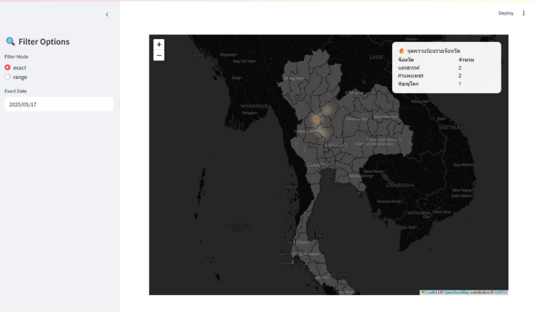
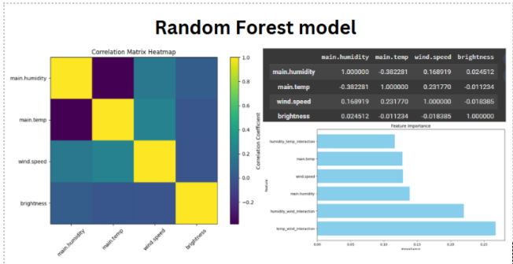

# 🔥 DSI321 Wildfire Alert System Project

## Project Overview

This project aims to develop a **near real-time wildfire alert system** for Thailand using data from **NASA FIRMS** and **OpenWeatherAPI**, orchestrated by **Prefect** and visualized via **Streamlit**. It supports the work of the National Disaster Management Subcommittee by integrating technical data workflows with practical data governance and machine learning analysis.

The system includes:
- ETL pipeline via Prefect
- Data versioning with LakeFS
- Interactive map-based dashboard (Streamlit + Folium)
- Fire prediction analysis using Random Forest

---

## 🧠 Part 1: Technical Implementation (90 Points)

### 1. Repository Setup (10 Points)
- Repository created within the first week.
- Repository name: `dsi321_2025`
- File Structure:
  - `data/` – Wwather data in Parquet format
  - `visualization/shape_file/` – Geospatial shape files
  - `Machine_learning.ipynb` – ML model
  - `api/` – Scripts for ETL (e.g., `firmapiflow.py`, `apiweatherflow.py`)
  - `visualization/` – Streamlit dashboard

### 2. Commit Frequency (10 Points)
- Maintained a steady commit frequency:
  - ≥ 5 commits/week for 3 consecutive weeks


### 3. README Quality (10 Points)
- README contains > 1,000 characters
- Provides detailed breakdown of project objective, tools used, architecture, grading alignment

---

### 4. Dataset Quality (50 Points)

| Criteria                             | Status | Notes                                                                 |
|-------------------------------------|--------|-----------------------------------------------------------------------|
| ≥ 1,000 Records                     | ✅     | Data collected every 15 min; > 96 records/day                         |
| 24-Hour Time Coverage               | ✅     | Daily collection via Prefect schedule                                 |
| Data Completeness ≥ 90%            | ✅     | Verified during ingestion using quality checks in Prefect            |
| No `object` Columns                 | ✅     | Parquet format with clearly defined schema                           |
| No Duplicate Records                | ✅     | Deduplication logic in Prefect ETL pipeline                          |

### 5. Schema Consistency (10 Points)
- Structured fields:
  - `timestamp` (datetime), `latitude`, `longitude`, `brightness`, `confidence`
  - `temperature`, `humidity`, `wind_speed` – all numeric
- Data types enforced via Parquet and LakeFS schema tracking

---

## 📊 Part 2: Project Report (10 Points)

### 1. Data Visualization (5 Points)
- Tools used: **Streamlit**, **Folium**, **GeoPandas**
- Key Visuals:
  - Heatmap of fire hotspots by province
  - Correlation matrix (weather vs brightness)
  - Scatter plots (e.g., temp vs brightness)
- Features:
  - Interactive map
  - Zoomable and filterable timeline

  


### 2. Machine Learning (5 Points)
- Model: **Random Forest Regression**
- Target: `brightness`
- Features: `temperature`, `humidity`, `wind_speed`
- Results:
  - Feature importance analysis highlights temperature and humidity as key indicators
  - Correlation matrix supports feature relationships
- Tools: Scikit-learn, Matplotlib



---

## 🛠 Tools & Architecture

| Component             | Tool/Technology         |
|-----------------------|--------------------------|
| Data Ingestion        | Prefect                  |
| Data Storage          | LakeFS + Parquet         |
| Dashboard             | Streamlit + Folium       |
| Geospatial Handling   | GeoPandas                |
| Machine Learning      | Scikit-learn (RandomForest) |
| Metadata Management   | CKAN                     |

---

## ✅ Outcomes
- Automated ETL pipeline for real-time fire + weather data
- Complete interactive dashboard for decision makers
- Validated model identifying environmental factors affecting fire intensity
- Designed with scalability and data governance in mind

---

## 🚀 Getting Started Locally

1. **Clone the Repository**
   ```bash
   git clone <repo-url>
   cd <repo-folder>
2. **Start Services**
     ```bash
    docker-compose up --build
    ```
    After successful deployment, you can access: <br>
   <b>Prefect Dashboard</b> : http://localhost:4200 <br>
   <b>JupyterLab</b> :  http://localhost:8888 <br>
   <b>LakeFS</b> : http://localhost:8000<br>
   <b>Stramlit</b> : http://localhost:8501

   > [!IMPORTANT]  
   > Before executing `deploy.py`, you must first **create a repository named `weather` in LakeFS**.

> 
3. **Deploy Prefect Flow**:
   Deploy the pipeline .:
 
    ```bash
   # via JupyterLab at http://localhost:8888 
   ## Start new terminal session

   python apiweatherdeploy.py 
   python firmsapideploy.py
   ```
   
    This creates a deployment  in the `default-agent-pool` work 
💡 Before deploying, ensure a weather repository exists in LakeFS.


